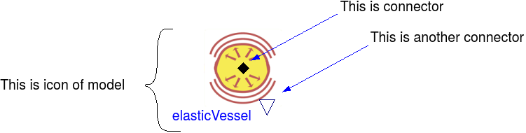
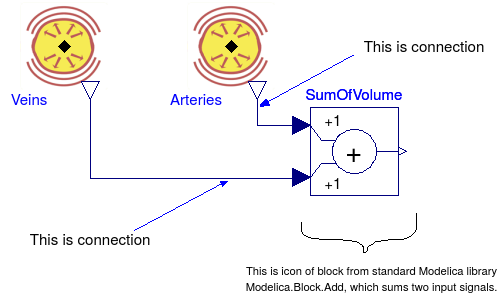

# Introduction to Modelica


Modelica language is object oriented, equation based and acausal modeling language maintained by the Modelica association [www.modelica.org](http://www.modelica.org).

### What can be Modelica describe

Modelica can describe a system by set of mathematical equations. Currently ordinary differential equations (ODE) and differential aglebraic equations (DAE) can be expressed in modelica and a support for partial differential equation (PDE) is being developed and designed. It's not domain specific and is used by automotive, engineering industry in designing, optimizing and simulating devices and complex systems.

### What tools can be used

Modelica standard language has several implementation. Commercial Dymola by Dassault Systemes offers robust environment integrated with other 3D design products [www.3ds.com](http://www.3ds.com/products-services/catia/products/dymola). Another commercial tool is Wolfram System Modeler, which additionally allows integration with their another product Mathematica [www.wolfram.com/system-modeler/](http://www.wolfram.com/system-modeler/). Another commercial tool SimulationX by ITI [www.itisim.com/simulationx](http://www.itisim.com/simulationx). 
OpenModelica is open source implementation of Modelica standard and offers compiler and editor for several platforms [www.openmodelica.org](http://www.openmodelica.org). Further model examples are tested with OpenModelica tool.

### Modelica elements

As Modelica is declarative, it doesn't depend the order of elements in which are defined. The basic elements are classes (models), variables, parameters and equations. 


```
model Arteries //class (model) definition
  Real p; //variable of pressure
  Real q; //variable of flow
  parameter Real C; //parameter of compliance
  Real V; //variable of volume
equations
  p = V/C;  // algebraic equation p =V/C
  der(V) = q; //differential equation dV/dt=q
end ArteriesAndVeins
```

### Equation based
Modelica is *equation based*, this means that the model can be expressed using equations instead of assignment statements. Modelica tool will decide which variable is input and output upon compilation.

```
...
  qv = R* (p2-p1);
  qa = - qv;
... 
// is quivalent to
...
  R = qv/(p2-p1);
  qv = -qa;
...
```
### Object-oriented
*Object orientation* means that model is defined as a class, which can be instantiated. Each instance share type and differ in parameters and the place where it is used. Other models can be composition of submodels. Inheritance and some sort of polymorphism is possible.

```
model Veins
  extends Arteries; //inherits all variables,parameters and equations from Arteries
end Veins;

model ArteriesVeins //composition of several models
  Arteries a; 
  Veins v;
  Resistance R;
equations
  a.p = R.p1; //access to instance variables is e.g. via dot notation
  v.p = R.p2;
end ArteriesVeins;
```

### Graphical

*Graphical* means that the models can be defined in diagram form instead of textual form. The model can be presented as an icon. Icon may contains special purpose class *connector* which allows internal variables to be presented outside.



Compatible connectors of several icons can be connected, each connection (line) represents equation between connected variables. 



The above connections are also called causal, because causality is given by the model, thus this is equivalent to the statements (with ':=' )

```
SumOfVolume.u1 := Arteries.volume;
SumOfVolume.u2 := Veins.volume;
// SumOfVolume.y = SumOfVolume.u1+SumOfVolume.u2;
```

### Acausal

*Acausal* means that the model composed of several submodels do not need explicitly declare what is input and output. Acausal connector is special purpose connector to define define "flow" and "non-flow" variables of the model shared with other models or classes. Connecting two or more components via acausal connector will generate analogy of Kirchhoff's law equations, which ensure equality of all "non-flow" variables, e.g. pressures $$p$$ in connectors 

$$p_1=p_2=\ldots =p_n$$

and zero sum of all "flow" variables e.g.flowrates $$q_i$$ in connectors

$$\sum_{i=1}^n q_i=0$$.


The basics of various systems can be explained using analogy between domains. Analogies exists in electrical and mechanical domains, hydraulic, thermodynamic and chemical domain too. In examples above the acausal connector of hydraulic domain is defined:

```
connector HydraulicPort 
  "Hydraulical connector with pressure and volumetric flow"
  Real p "Pressure";
  flow Real q "Volume flow";
end HydraulicPort;
```


